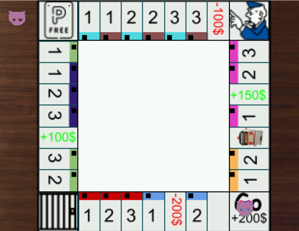
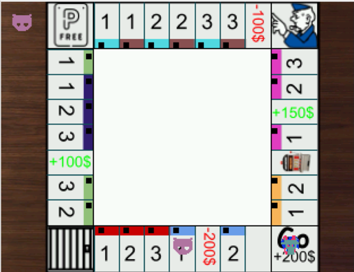
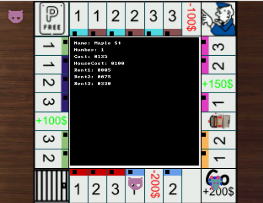
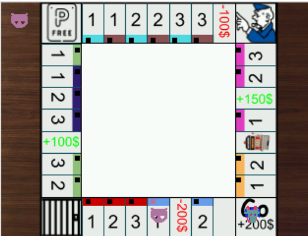
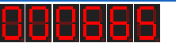
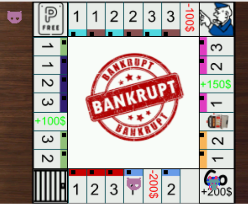
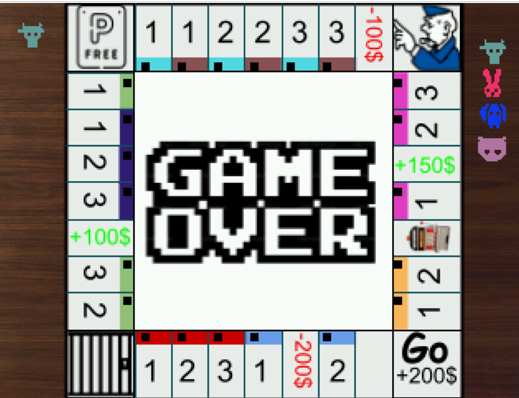

# Monopoly on De1-SoC
 

## Description
Monopoly like game on the DE1-SoC board with NIOS II assembly. Made using C. The game has vga display integration, audio output and PS/2 keyboard input. 

Shown here is the simulation of code done in https://cpulator.01xz.net. 

## How to Play

### Controls
| Action | Key | 
|----------|----------|
| Roll Dice | 'R' Key + 'Enter' Key | 
| Buy Property | 'B' Key + 'Enter' Key | 
| Open/Close Current Property Info | 'A' Key + 'Enter' Key | 
| Next Player (end Move)| 'N' Key + 'Enter' Key|

### Game
1. Press R+Enter to roll dice and move. On the top left is the current player's icon Seven segment displays on the board show current player's bank. Music is playing while game runs, and sound effects such as a dice sound effect play when the user does something.

 

2. Press A+Enter to view property details, then A+Enter again to close them. Press B+Enter to buy the property, decreasing amount in bank and changing square on property to match the color of the player. When other players go to purchased property, they lose money and the owner gains money. 

  

 

3. Press N+Enter to end turn. 

4. When a player has less than or equal to 0, they go bankrupt and are out of the game. Their icon is put to the right. When there is only one player remaining, the game is over, and the player at the top of the right icon tower is the winner. 

 

5. The go to jail square sends player to jail, moving them and skipping next turn. The + and - square gives/takes indicated amount. The slots square gives/takes a random amount of money. 